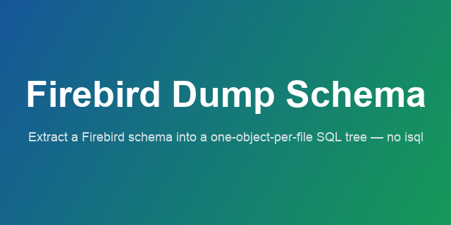

<p align="center"></p>

# Firebird Dump Schema

[English](README.md) · **Русский**

[](LICENSE)
[](https://github.com/deliciousNesquik/firebird-dump-schema/releases)
[](https://firebirdsql.org/)

Утилита командной строки для извлечения **DDL-метаданных** базы данных Firebird в
структурированное дерево **«один объект — один файл»** (`.sql`). Для контроля версий
схемы, резервного копирования и CI/CD.

Читает системный каталог напрямую через [`firebird-lib`](https://pypi.org/project/firebird-lib/)
и запрашивает DDL у каждого объекта — **без `isql`** и без разбора монолитного дампа.
Тип и имя объекта берутся из каталога, системные объекты отфильтровываются автоматически.

---

## Содержание

- [Возможности](#возможности)
- [Установка](#установка)
- [Требования](#требования)
- [Конфигурация (`.env`)](#конфигурация-env)
- [Использование](#использование)
- [Опции командной строки](#опции-командной-строки)
- [Структура вывода](#структура-вывода)
- [Коды возврата и поведение](#коды-возврата-и-поведение)
- [`--with-deps` (выгрузка зависимостей)](#--with-deps-выгрузка-зависимостей)
- [Транзакции](#транзакции)
- [Логирование](#логирование)
- [Оговорки и ограничения](#оговорки-и-ограничения)
- [Воссоздание схемы](#воссоздание-схемы)
- [Разработка](#разработка)
- [Лицензия](#лицензия)

---

## Возможности

- **Один объект — один файл** в стабильном нумерованном дереве → чистые diff'ы и код-ревью схемы.
- **Три режима:** полный дамп, точечная выгрузка названных объектов, список.
- **Прямое чтение каталога** через `firebird-lib` — без `isql` и парсинга баннеров.
- **Автоматическая фильтрация системных объектов** по флагу каталога — без ручных списков.
- **Исполнимый вывод** — PSQL-объекты обёрнуты в блоки `SET TERM`; каждый файл самодостаточен.
- **Детерминированный вывод** — стабильный порядок между прогонами, минимум шума в diff'ах.
- **Выгрузка зависимостей** (`--with-deps`) — подтянуть всё, от чего зависит объект.
- **Безопасность** — учётные данные читаются из окружения, не передаются в аргументах команды, маскируются в логах.
- **Персистентный аудит** — весь вывод дублируется в `audit_YYYYMMDD.log` (отключаемо).
- **Кросс-платформенность** — готовые бинарники под Windows/Linux/macOS либо запуск из исходников.

## Установка

### Готовые бинарники (Python не нужен)

Скачайте самодостаточный исполняемый файл со страницы
[**Releases**](https://github.com/deliciousNesquik/firebird-dump-schema/releases)
(собирается под Windows, Linux и macOS):

| ОС | Файл |
| --- | --- |
| Windows | `fb-dump-schema-windows-x64.exe` |
| Linux | `fb-dump-schema-linux-x64` |
| macOS | `fb-dump-schema-macos-arm64` |

```bash
# Linux / macOS
chmod +x fb-dump-schema-linux-x64
./fb-dump-schema-linux-x64 --help
```

- **macOS:** бинарь не подписан — при первом запуске разрешите его в
  *Системные настройки → Конфиденциальность и безопасность*.
- **Нужна клиентская библиотека Firebird.** Бинарю в рантайме всё равно требуется
  `fbclient.dll` / `libfbclient.so` / `libfbclient.dylib` (её грузит драйвер). Обычно она
  уже есть там, где работают с Firebird; иначе поставьте Firebird client (или сервер).
  Это единственная зависимость, которую нельзя зашить в бинарь.

### Из исходников (через [uv](https://docs.astral.sh/uv/))

```bash
git clone https://github.com/deliciousNesquik/firebird-dump-schema.git
cd firebird-dump-schema
cp .env.example .env          # заполнить учётные данные/пути
uv run fb-dump-schema --help  # uv соберёт окружение из pyproject.toml автоматически
```

Без `uv` — установите пакет в venv и запускайте `python -m fbschema`.

## Требования

- **Целевая СУБД:** Firebird 3 / 4 / 5. (Firebird 2.5 вне охвата — нужен другой драйвер.)
- **Клиентская библиотека Firebird** (`libfbclient`), доступная для `firebird-driver`.
- **Для запуска из исходников:** Python 3.11+; зависимости `firebird-driver`,
  `firebird-lib`, `python-dotenv` (объявлены в `pyproject.toml`).

## Конфигурация (`.env`)

Параметры подключения читаются из `.env` (путь — через `-c/--config`, по умолчанию `./.env`).

| Переменная | Обяз. | По умолчанию | Описание |
| --- | :---: | --- | --- |
| `ISC_USER` | ✅ | — | Пользователь БД (напр. `SYSDBA`). |
| `ISC_PASSWORD` | ✅ | — | Пароль пользователя. |
| `FB_DATABASE` | ✅ | — | Адрес БД. Локально: путь или алиас. Удалённо: `HOST:ALIAS_OR_PATH`. |
| `DUMP_DIR` | ✅ | — | Каталог вывода дерева схемы. Абсолютный или относительный (от текущей рабочей директории). |
| `ISQL_TIMEOUT` | — | `0` | Таймаут чтения метаданных в секундах; `<= 0` отключает. Только POSIX (SIGALRM). |
| `DB_CHARSET` | — | `UTF8` | Кодировка соединения. Для legacy-баз с однобайтовыми метаданными укажите явно (напр. `WIN1251` для кириллицы), иначе чтение упадёт с `UnicodeDecodeError`. |
| `AUDIT_LOG` | — | `true` | Писать `audit_YYYYMMDD.log`. `false`/`0`/`no`/`off` — не создавать файл. |

Префикс `ISC_*` намеренный: это стандартные переменные Firebird; читаются в рантайме и
не передаются в аргументах команды (не утекают через `ps aux`).

## Использование

Путь к конфигу — флаг (`-c/--config`, по умолчанию `./.env`); имена объектов — позиционные.

### Полный дамп

Нет имён и нет `--list` → выгрузить всю схему (дерево очищается и пересоздаётся).

```bash
fb-dump-schema                    # использует ./.env
fb-dump-schema -c production.env  # кастомный конфиг (несколько баз)
```

### Точечная выгрузка

Одно или несколько имён → выгрузить только эти объекты. Имена могут совпадать между
типами; `--type` уточняет. Без `--type` выгружаются **все** совпадения по категориям.

```bash
fb-dump-schema ACCOUNT                 # все объекты с именем ACCOUNT
fb-dump-schema ACCOUNT --type table    # только таблица
fb-dump-schema CALC_TOTAL --stdout     # печать DDL в консоль, не в дерево
fb-dump-schema V_REPORT --with-deps    # объект + всё, от чего он зависит
```

По умолчанию точечный режим пишет в существующий `DUMP_DIR`, **обновляя только файлы
названных объектов** (дерево *не* очищается, удалённые файлы *не* подчищаются — это
делает полный дамп). Гранты и комментарии в точечном режиме не трогаются (их освежает
полный дамп). `--stdout` печатает SQL и не трогает ФС.

### Список

```bash
fb-dump-schema --list                  # все объекты по категориям
fb-dump-schema --list --type procedure # только процедуры
```

## Опции командной строки

| Опция | Режим | Описание |
| --- | --- | --- |
| `-c`, `--config ENV` | все | Путь к `.env` (по умолчанию `./.env`). |
| `ИМЕНА…` (позиционные) | точечный | Имена объектов для выгрузки. Наличие включает точечный режим. |
| `--type TYPE` | точечный, список | Ограничить одним типом объекта. В режиме списка — фильтр. |
| `--list` | список | Перечислить объекты по категориям и выйти. |
| `--stdout` | точечный | Печать SQL в stdout вместо записи в дерево. |
| `--with-deps` | точечный | Также выгрузить объекты, от которых зависят названные (транзитивно). |
| `--with-generator-values` | все | Писать текущие значения генераторов/секвенций (по умолчанию нет — см. ниже). |
| `-h`, `--help` | — | Справка. |

**Значения `--type`:** `table`, `index`, `view`, `procedure` (`proc`), `function`,
`external-function` (`udf`), `trigger`, `exception`, `domain`, `generator` (`sequence`),
`role`, `package`. (`grant`/`comment` — кросс-секущие, не выбираются.)

`python -m fbschema …` эквивалентно команде `fb-dump-schema`.

## Структура вывода

В `DUMP_DIR` создаётся нумерованное дерево; имена файлов соответствуют именам объектов:

```
01_EXTERNAL_FUNCTIONS/   05_VIEWS/        09_PACKAGES/
02_GENERATORS/           06_EXCEPTIONS/   10_TRIGGERS/
03_DOMAINS/              07_FUNCTIONS/    11_ROLES/      (ROLES.sql)
04_TABLES/               08_PROCEDURES/   12_GRANTS/     (GRANTS.sql)
DATABASE.sql                              13_COMMENTS/   (COMMENTS.sql)
```

- **Таблицы** — `CREATE TABLE` и связанные констрейнты в одном файле; **индексы** —
  отдельными файлами в `04_TABLES`.
- **Процедуры / функции** — два соседних файла на объект: `<ИМЯ>.declaration.sql`
  (прямое объявление) и `<ИМЯ>.sql` (тело). Обрабатываются по отдельности и разрешают
  циклические зависимости.
- **Внешние функции (UDF)** идут в `01_EXTERNAL_FUNCTIONS`.
- **Пакеты** — заголовок + тело в одном файле.
- **Генераторы** по умолчанию выгружаются **без** текущего значения (это runtime-состояние,
  дающее шум в diff'ах); добавьте `--with-generator-values`, чтобы включить значение.
- **Роли / гранты / комментарии** агрегируются (`ROLES.sql`, `GRANTS.sql`,
  `COMMENTS.sql`); `DATABASE.sql` хранит преамбулу SQL-диалекта.
- **PSQL-объекты** обёрнуты в `SET TERM ^ ;` … `^` … `SET TERM ; ^`; остальное завершается
  `;`. Вывод детерминирован (сортировка) для стабильных diff'ов.

## Коды возврата и поведение

| Код | Значение |
| :---: | --- |
| `0` | Успех. |
| `1` | Ошибка инфраструктуры / конфига / таймаут (не подключиться, плохой `.env`, истёк таймаут). |
| `2` | Ошибка аргументов командной строки (неверная комбинация или неизвестный `--type`). |
| `3` | Частичный прогон: часть объектов пропущена (ошибка / нет прав) или запрошенные имена не найдены. |

Сбой отдельного объекта (`get_sql_for` бросил исключение или нет прав) логируется
предупреждением, пропускается и считается — он **не** валит весь дамп (удобно для CI).

Ошибки аргументов с кодом `2`: `--list` вместе с именами; `--list` вместе с `--stdout`;
`--stdout` или `--with-deps` без имён; `--type` в полном режиме (нет имён и нет `--list`);
неизвестное значение `--type`.

## `--with-deps` (выгрузка зависимостей)

В точечном режиме `--with-deps` дополнительно выгружает всё, от чего зависят названные
объекты, **рекурсивно (транзитивно)** — для самодостаточного, воссоздаваемого набора.
Это обход в ширину с защитой от циклов.

Пример для представления `DBA$MONITOR`, читающего таблицу `USERLIST`:

```
DBA$MONITOR (view)
├─ USERLIST (table)                  ← уровень 1: из RDB$DEPENDENCIES
│   ├─ BAS$ID, BAS$MEMO, …            ← уровень 2: домены столбцов USERLIST
├─ BAS$TIMESTAMP                     ← из тела представления (RDB$DEPENDENCIES)
└─ BAS$INTEGER, BAS$VAR_100          ← домены столбцов самого представления
```

Источники зависимостей:

- **`RDB$DEPENDENCIES`** (представления → таблицы, процедуры → процедуры/таблицы, выражения…).
- **Домены столбцов / параметров** — связь «столбец → домен типа» Firebird в
  `RDB$DEPENDENCIES` не фиксирует, поэтому собирается отдельно.

Не отслеживается: связи вне этих источников — например, таблицы по внешнему ключу или
объекты, упомянутые только в динамическом SQL.

## Транзакции

Метаданные всегда читаются в транзакции **read-committed + record-version + NO WAIT**
(режим WAIT может «подвесить» процесс на конфликте блокировок). NO WAIT принудительно
навязывается транзакции, которую `firebird-lib` открывает внутри себя.

## Логирование

Диагностический вывод идёт в **stderr**, поэтому **stdout остаётся чистыми данными**
(имена в `--list`, SQL в `--stdout`) — удобно для пайпов и редиректа. В режимах записи в
дерево (полный и точечный) диагностика также дублируется в персистентный
`audit_YYYYMMDD.log` в текущей директории; отключается через `AUDIT_LOG=false`. Пароль
маскируется (`********`).

## Оговорки и ограничения

- **Не байт-в-байт как `isql -a`.** `firebird-lib` форматирует DDL иначе (пробелы, порядок
  клауз), хотя семантически эквивалентно. Первый прогон по дереву от другого инструмента
  даёт крупный одноразовый diff.
- **Порядок представлений.** При «один объект — один файл» порядок зависимостей между
  вьюхами не гарантирован при алфавитной склейке одной директории.
- **`--with-deps`** не идёт по внешним ключам и динамическому SQL (см. выше).
- **Кодировка.** Legacy-базам с однобайтовой кодировкой нужно явно задать `DB_CHARSET`.
- **Производительность по WAN.** `firebird-lib` читает часть метаданных лениво, по объекту;
  по высоколатентному каналу полный дамп большой БД может быть медленным. Гоняйте полный
  дамп рядом с БД (LAN); точечные выгрузки дёшевы.
- **Firebird 2.5** вне охвата.

## Воссоздание схемы

Склейте файлы в порядке директорий (`01_*` → `13_*`) и подайте в `isql` на свежую БД. Для
процедур/функций примените сначала все `*.declaration.sql`, затем тела (прямые объявления
разрешают циклические зависимости). Нумерация директорий задаёт правильный межкатегорийный
порядок.

## Разработка

```bash
uv run pyright fbschema   # проверка типов (ожидается 0 ошибок)
uv run pytest -q          # офлайн-тесты (БД не нужна)
```

Тесты гоняются на мок-схеме — не нужны ни живая БД, ни `libfbclient`. CI (GitHub Actions)
прогоняет типы + тесты на каждый push; тег `vX.Y.Z` собирает и публикует бинарники.

## Лицензия

[MIT](LICENSE).
